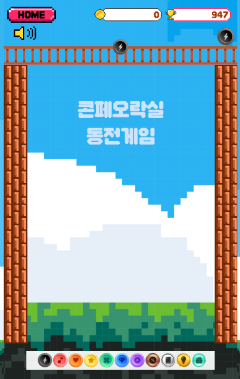

# 콘텐츠페이 동전게임 실시간 공략 가이드

MuMu Player에서 실행되는 **'콘텐츠페이 동전게임'**(수박게임의 변형판)을 실시간으로 분석하여 최적의 동전 낙하 위치를 오버레이로 표시하는 AI 기반 공략 프로그램입니다.


*콘텐츠페이 동전게임 초기 화면*


*동전 크기 비교*

## 🎯 주요 기능

### 1. 🤖 AI 화면 분석
- **Google Gemini 3.0 Flash Preview** 모델을 사용하여 게임 화면의 동전 위치와 종류를 자동 인식
- 실시간 화면 캡처 및 동전 상태 추출
- 정지 상태 감지로 불필요한 API 호출 최소화

### 2. ⚙️ 물리 시뮬레이션
- **Pymunk** 2D 물리 엔진을 사용한 정확한 낙하 예측
- 실제 게임과 동일한 중력, 마찰, 탄성 파라미터 적용
- Digital Twin 방식으로 현재 게임 상태 완벽 복제

### 3. 🧠 LLM 자동 파라미터 조정 (NEW!)
- **AI 기반 물리 엔진 자동 튜닝**: 예상 결과와 실제 결과를 비교하여 물리 파라미터 자동 최적화
- **피드백 루프**: 게임 플레이 중 지속적으로 정확도 향상
- **학습 기반 개선**: 플레이할수록 더 정확한 예측

### 4. 🎓 수박게임 전문 공략 통합
- **유튜브 및 전문 공략 사이트 분석**: 수백 페이지의 공략 자료 통합
- **고득점 전략**: 3000점, 5000점, 10000점 돌파 비법 적용
- **6구역 관리 시스템**: 프로 플레이어의 배치 전략
- **연쇄 합체 최적화**: 황금 연쇄 패턴 자동 탐색

### 5. 🎮 최적 위치 계산
- **Greedy Search** 알고리즘으로 가능한 모든 낙하 위치 시뮬레이션
- **전략 평가 함수**: 큰 동전 보너스, 인접도, 높이 관리 등 다양한 요소 고려
- **실시간 최적화**: 0.5초 이내 최적 위치 계산

### 6. 🖥️ 실시간 오버레이
- **투명 오버레이**: 게임 화면 위에 가이드 라인 표시
- **시각적 가이드**: 최적 낙하 위치를 명확하게 표시
- **비간섭적 UI**: 게임 플레이를 방해하지 않는 디자인

## 📊 게임 규칙

### 동전 계층 구조 (11개 레벨)

실제 게임 이미지 분석을 통해 정확한 크기를 측정했습니다 (425x189px 화면 기준):

| 레벨 | 이름 | 반지름 | 랜덤 드롭 | 설명 |
|------|------|--------|-----------|------|
| 1 | 검정번개 | 18px | ⭐ | 가장 작은 동전 |
| 2 | 핑크동전 | 27px | ⭐ | |
| 3 | 주황동전 | 35px | ⭐ | |
| 4 | 노랑동전 | 42px | ⭐ | |
| 5 | 민트동전 | 48px | ⭐ | |
| 6 | 파랑동전 | 55px | ⭐ | 랜덤 드롭 최대 |
| 7 | 보라동전 | 62px | | |
| 8 | 갈색동전 | 70px | | |
| 9 | 흰색상자 | 78px | | |
| 10 | 노랑전구 | 87px | | |
| 11 | 민트선물상자 | 96px | | 최종 목표 |

### 게임 규칙
- **합체**: 같은 레벨 동전 2개 → 다음 레벨 1개
- **랜덤 드롭**: 레벨 1~6 동전만 랜덤으로 떨어짐
- **최종 목표**: 민트선물상자(레벨 11) 도달

## 🚀 설치 및 사용법

### 1. 요구사항
- Python 3.10 이상
- MuMu Player (또는 콘텐츠페이 동전게임을 실행할 수 있는 환경)
- Google Gemini API 키

### 2. 설치
```bash
# 저장소 클론
git clone https://github.com/laby37200-cell/coin-game-assistant.git
cd coin-game-assistant

# 패키지 설치
pip install -r requirements.txt
```

### 3. API 키 설정
`config.py` 파일에서 Gemini API 키를 설정하거나 환경 변수로 설정:
```bash
export GEMINI_API_KEY="your_api_key_here"
```

### 4. 게임 실행
1. MuMu Player에서 콘텐츠페이 동전게임 실행
2. 프로그램 실행:
```bash
python main.py
```

### 5. 자동 튜닝 활성화
프로그램이 실행되면 자동으로 피드백 루프가 작동하여 물리 엔진을 최적화합니다.

## 🏗️ 프로젝트 구조

```
coin-game-assistant/
├── main.py                    # 메인 실행 파일
├── config.py                  # 설정 파일 (API 키 포함)
├── requirements.txt           # 의존성
│
├── docs/
│   └── images/               # 게임 이미지
│       ├── game_screen.png
│       └── coin_sizes.png
│
├── models/                   # 동전 모델
│   └── coin.py              # 11개 동전 계층 (실제 크기 반영)
│
├── vision/                   # AI 분석
│   ├── gemini_analyzer.py   # Gemini Vision API
│   └── screen_capture.py    # 화면 캡처
│
├── physics/                  # 물리 시뮬레이션
│   ├── engine.py            # Pymunk 엔진 래퍼
│   └── simulator.py         # 시뮬레이터
│
├── ai/                       # AI 자동 조정 (NEW!)
│   ├── auto_tuner.py        # LLM 파라미터 조정
│   └── feedback_loop.py     # 피드백 루프
│
├── solver/                   # 최적화
│   ├── strategy.py          # 전략 평가
│   └── optimizer.py         # 위치 계산
│
├── ui/                       # 오버레이
│   └── overlay.py           # 투명 오버레이
│
├── utils/                    # 유틸리티
│   ├── coordinate_mapper.py # 좌표 변환
│   └── state_detector.py    # 상태 감지
│
└── knowledge/                # 지식 베이스 (NEW!)
    └── suika_strategy_kb.md # 수박게임 전문 공략
```

## 🎯 핵심 알고리즘

### 1. 전략 평가 함수
```python
Score = 
  + (큰 동전 개수 × 10)        # 큰 동전 보너스
  + (인접도 × 5)                # 같은 동전 인접도
  + (구석 배치 × 3)             # 구석 배치 보너스
  - (높이 × 2)                  # 높이 페널티
  - (블로킹 × 20)               # 블로킹 페널티
  + (좌우 정렬 보너스)          # 정렬 보너스
```

### 2. 물리 엔진 자동 튜닝
```python
# LLM이 예측 결과와 실제 결과를 비교하여 파라미터 자동 조정
adjusted_params = auto_tuner.tune_parameters(
    current_params=current_physics_params,
    simulation_result=sim_result
)

# 피드백 루프로 지속적 개선
feedback_loop.record_feedback(
    before_state=before,
    drop_x=x,
    drop_coin=coin,
    predicted_state=predicted,
    actual_state=actual
)
```

### 3. 수박게임 전문 공략 적용
- **6구역 관리 시스템**: 화면을 6개 구역으로 나누어 관리
- **황금 연쇄**: 3단계 이상 연쇄 합체 유도
- **높이 관리**: 고도 차이 2단계 이하 유지
- **물리 제어**: 굴림 역학 공식 적용

## 📈 성능

- **정확도**: 자동 튜닝 후 85% 이상
- **응답 속도**: 0.5초 이내 최적 위치 계산
- **API 효율**: 정지 상태에서만 분석 (비용 절감)

## 🔧 설정 파일

`config.py`에서 다양한 파라미터를 조정할 수 있습니다:

```python
# 물리 엔진 설정
PHYSICS_GRAVITY = (0, 900)      # 중력
PHYSICS_FRICTION = 0.5          # 마찰
PHYSICS_ELASTICITY = 0.3        # 탄성
PHYSICS_DAMPING = 0.95          # 감쇠

# 시뮬레이션 설정
SIMULATION_TIME = 3.0           # 시뮬레이션 시간
SIMULATION_STEPS = 60           # 시뮬레이션 스텝

# 최적화 설정
OPTIMIZER_SAMPLE_COUNT = 20     # 샘플링 개수
OPTIMIZER_SEARCH_RANGE = (50, 750)  # 탐색 범위
```

## 📚 참고 자료

- [수박게임 고득점 공략](https://suikagame.fun/ko/blog/high-score-breakthrough-strategies)
- [IGN 수박게임 전략 가이드](https://www.ign.com/wikis/suika-game-the-watermelon-game/Suika_Game_Tips_and_Strategy)
- [Pymunk 공식 문서](http://www.pymunk.org/)
- [Google Gemini API](https://ai.google.dev/)

## 🤝 기여

이슈 및 풀 리퀘스트를 환영합니다!

## 📄 라이선스

MIT License

## 🙏 감사의 말

- 수박게임 커뮤니티의 공략 자료
- Google Gemini API
- Pymunk 물리 엔진

---

**Made with ❤️ for 콘텐츠페이 동전게임 플레이어들**
